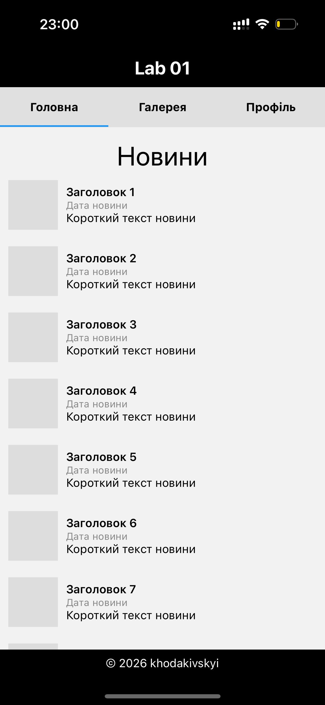
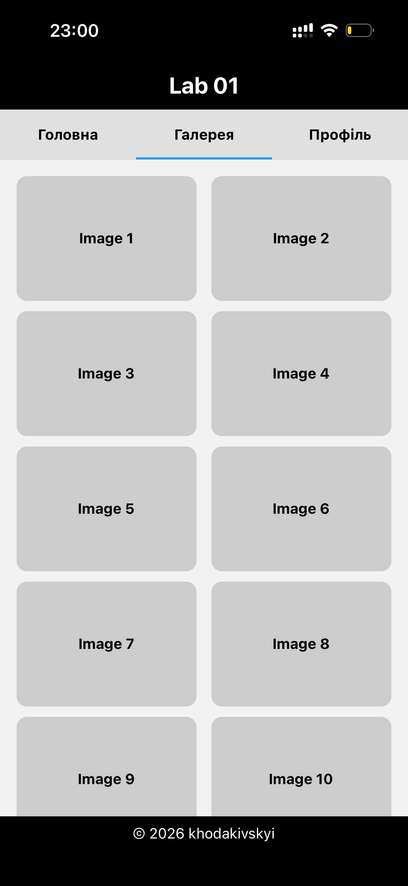
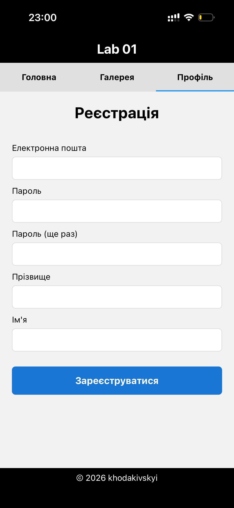

# Lab 01 — React Native Practice

A mobile application built with React Native and Expo as part of a practical lab assignment. The app demonstrates tab-based navigation, a scrollable news feed with cards, and a consistent layout with a fixed header and footer.

---

## Project Structure

```
lab01/
├── app/
│   ├── _layout.tsx          # Root stack layout
│   └── (tabs)/
│       ├── _layout.tsx      # Tab layout with header, menu, footer
│       └── index.tsx        # Home screen (news feed)
├── components/
│   ├── TabsMenu.tsx         # Material top tab navigator
│   └── NewsCard.tsx         # News item card component
├── data/
│   └── news.json            # Static news data
├── app.json                 # Expo configuration
└── package.json
```

---

## Screens

### Screenshots

<table>
  <tr>
    <td align="center" width="33%"><b>Home tab</b></td>
    <td align="center" width="33%"><b>Gallery tab</b></td>
    <td align="center" width="33%"><b>Profile tab</b></td>
  </tr>
  <tr>
    <td align="center"></td>
    <td align="center"></td>
    <td align="center"></td>
  </tr>
</table>

---

## Getting Started

### Prerequisites

- Node.js >= 18
- npm or yarn
- Expo CLI (`npm install -g expo-cli`)
- For iOS: macOS with Xcode installed
- For Android: Android Studio with an emulator configured, or a physical device

### Installation

```bash
cd lab01
npm install
```

### Running the App

```bash
# Start the Expo development server
npm start

# Open directly on Android
npm run android

# Open directly on iOS
npm run ios

# Open in a web browser
npm run web
```

---

## Launch Methods

React Native / Expo applications can be run in several ways. Each method has its own purpose and trade-offs during development and testing.

### Expo Go (Physical Device)

Expo Go is an application available on the App Store and Google Play. After starting the development server with `npm start`, scan the QR code displayed in the terminal or browser using the Expo Go app on your device.

**Purpose:** Quick preview on a real device without a build step.  
**Limitations:** Only supports packages included in the Expo SDK. Custom native modules are not supported.  
**Best for:** Early-stage UI development and layout testing.

---

### Android Emulator

An Android Virtual Device (AVD) created in Android Studio is used to simulate an Android device on your computer. Run `npm run android` to launch the app directly on the emulator.

**Purpose:** Testing Android-specific behavior, gestures, and system UI on a controlled environment.  
**Limitations:** Performance may differ from a physical device; does not replicate hardware sensors accurately.  
**Best for:** Android layout debugging and testing platform-specific features.

---

### iOS Simulator

The iOS Simulator is part of Xcode and is only available on macOS. Run `npm run ios` to launch the app on the simulator.

**Purpose:** Testing iOS-specific behavior and UI conventions.  
**Limitations:** Cannot simulate all hardware features (camera, Bluetooth, push notifications). macOS is required.  
**Best for:** iOS layout verification and navigation flow testing.

---

### Web Browser

Expo supports rendering React Native components in a web browser using React Native Web. Run `npm run web` to open the app in your default browser.

**Purpose:** Rapid iteration and debugging without a mobile device or emulator.  
**Limitations:** Not all React Native APIs are available on web. Visual output may differ from mobile platforms. Not suitable for final mobile testing.  
**Best for:** Quick logic checks, component rendering verification, and accessibility testing.

---

### Physical Android / iOS Device (via USB)

A physical device connected via USB can be used with `npm run android` (Android) or `npm run ios` (iOS, macOS only). The device must have developer mode enabled.

**Purpose:** Most accurate representation of real-world performance and behavior.  
**Limitations:** Requires device setup and, for iOS, an Apple Developer account.  
**Best for:** Final pre-release testing and performance profiling.

---

# Lab 01 — React Native Practice

Мобільний застосунок, розроблений на React Native та Expo в рамках практичної лабораторної роботи. Застосунок демонструє навігацію на основі вкладок, стрічку новин зі скроллом та картками, а також єдиний макет із фіксованим хедером і футером.

---

## Структура проєкту

```
lab01/
├── app/
│   ├── _layout.tsx          # Кореневий stack-layout
│   └── (tabs)/
│       ├── _layout.tsx      # Layout вкладок з хедером, меню та футером
│       └── index.tsx        # Головний екран (стрічка новин)
├── components/
│   ├── TabsMenu.tsx         # Навігатор вкладок (Material Top Tabs)
│   └── NewsCard.tsx         # Компонент картки новини
├── data/
│   └── news.json            # Статичні дані новин
├── app.json                 # Конфігурація Expo
└── package.json
```

---

## Екрани

### Скріншоти

<table>
  <tr>
    <td align="center" width="33%"><b>Вкладка «Головна»</b></td>
    <td align="center" width="33%"><b>Вкладка «Галерея»</b></td>
    <td align="center" width="33%"><b>Вкладка «Профіль»</b></td>
  </tr>
  <tr>
    <td align="center"></td>
    <td align="center"></td>
    <td align="center"></td>
  </tr>
</table>

---

## Початок роботи

### Передумови

- Node.js >= 18
- npm або yarn
- Expo CLI (`npm install -g expo-cli`)
- Для iOS: macOS з встановленим Xcode
- Для Android: Android Studio з налаштованим емулятором або фізичний пристрій

### Встановлення

```bash
cd lab01
npm install
```

### Запуск застосунку

```bash
# Запустити dev-сервер Expo
npm start

# Відкрити безпосередньо на Android
npm run android

# Відкрити безпосередньо на iOS
npm run ios

# Відкрити у браузері
npm run web
```

---

## Способи запуску

React Native / Expo застосунки можна запускати кількома способами. Кожен із них має своє призначення та особливості під час розробки і тестування.

### Expo Go (Фізичний пристрій)

Expo Go — застосунок, доступний в App Store та Google Play. Після запуску dev-сервера командою `npm start` потрібно відсканувати QR-код у терміналі або браузері за допомогою Expo Go на вашому пристрої.

**Призначення:** Швидкий перегляд на реальному пристрої без кроку збірки.  
**Обмеження:** Підтримуються лише пакети, включені до Expo SDK. Власні нативні модулі не підтримуються.  
**Найкраще підходить для:** Розробки інтерфейсу та перевірки макетів на ранніх етапах.

---

### Емулятор Android

Віртуальний пристрій Android (AVD), створений в Android Studio, імітує Android-пристрій на комп'ютері. Команда `npm run android` запускає застосунок безпосередньо на емуляторі.

**Призначення:** Тестування Android-специфічної поведінки, жестів та системного інтерфейсу у контрольованому середовищі.  
**Обмеження:** Продуктивність може відрізнятися від реального пристрою; апаратні сенсори відтворюються неточно.  
**Найкраще підходить для:** Налагодження макетів та тестування платформо-специфічних функцій на Android.

---

### Симулятор iOS

Симулятор iOS входить до складу Xcode і доступний лише на macOS. Команда `npm run ios` запускає застосунок на симуляторі.

**Призначення:** Тестування iOS-специфічної поведінки та стандартів інтерфейсу.  
**Обмеження:** Неможливо симулювати всі апаратні функції (камера, Bluetooth, push-сповіщення). Вимагається macOS.  
**Найкраще підходить для:** Перевірки макетів iOS та тестування потоку навігації.

---

### Веббраузер

Expo підтримує рендеринг компонентів React Native у веббраузері за допомогою React Native Web. Команда `npm run web` відкриває застосунок у браузері за замовчуванням.

**Призначення:** Швидка ітерація та налагодження без мобільного пристрою чи емулятора.  
**Обмеження:** Не всі API React Native доступні у вебі. Візуальний результат може відрізнятися від мобільних платформ. Не підходить для фінального тестування на мобільному.  
**Найкраще підходить для:** Швидкої перевірки логіки, рендерингу компонентів та тестування доступності.

---

### Фізичний пристрій Android / iOS (через USB)

Фізичний пристрій, підключений через USB, можна використовувати з командою `npm run android` (Android) або `npm run ios` (iOS, лише macOS). На пристрої має бути увімкнено режим розробника.

**Призначення:** Найточніше відображення реальної продуктивності та поведінки застосунку.  
**Обмеження:** Вимагає налаштування пристрою, а для iOS — облікового запису Apple Developer.  
**Найкраще підходить для:** Фінального тестування перед релізом та профілювання продуктивності.
