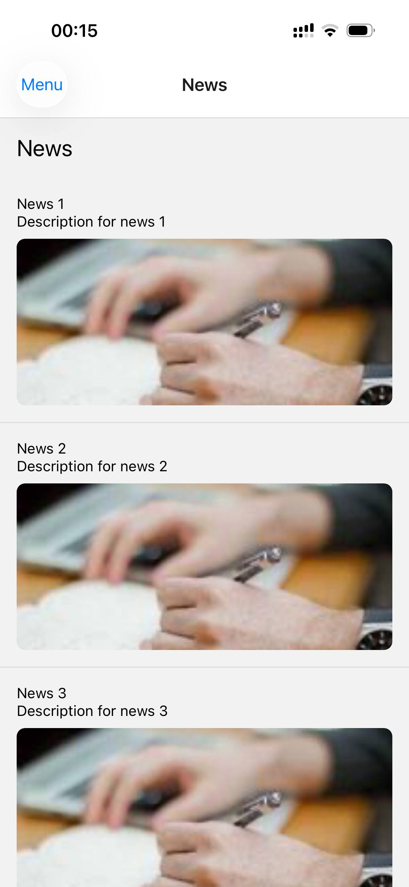
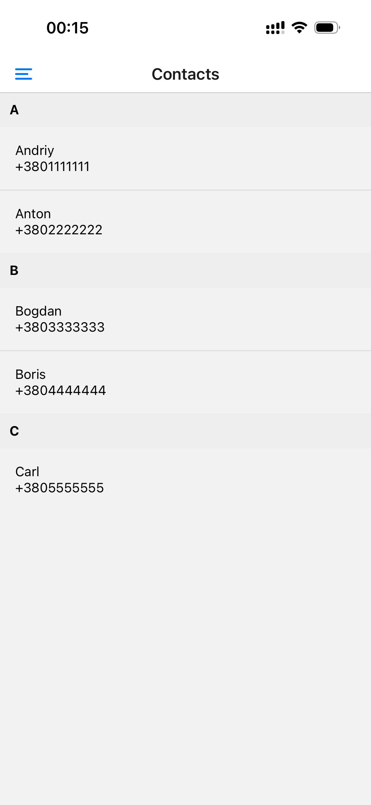
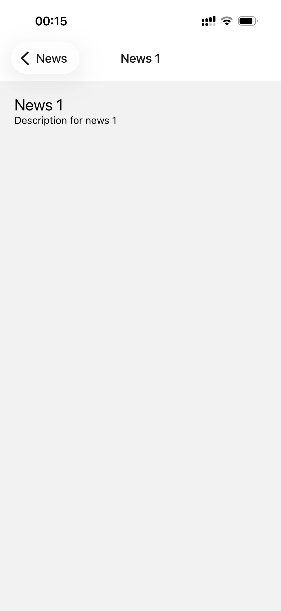
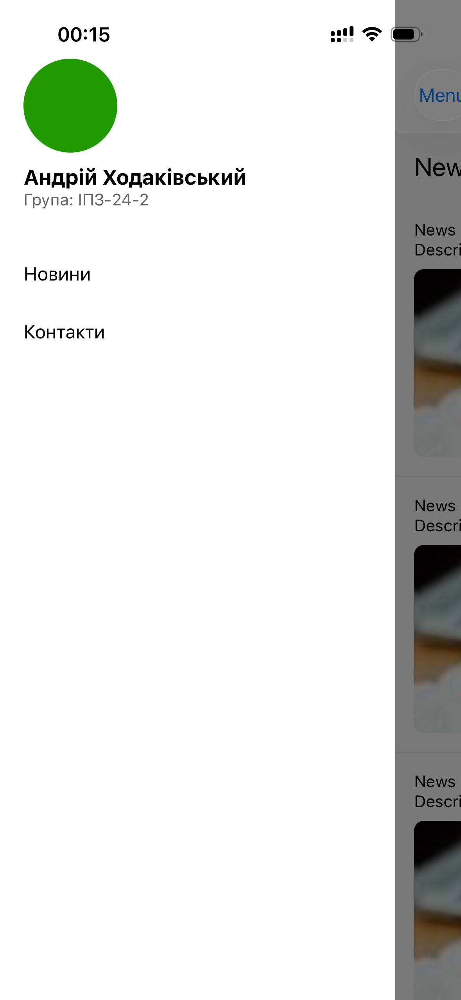

# Lab 2 — React Native

## Запуск проєкту

1. Встановити залежності:
   ```bash
   npm install
   ```
   або
   ```bash
   yarn
   ```

2. Запустити застосунок:
   ```bash
   npx react-native start
   ```
   В іншому терміналі:
   ```bash
   npx react-native run-android
   ```
   або
   ```bash
   npx react-native run-ios
   ```

3. За потреби встановити Expo Go / емулятор та налаштувати Android SDK / Xcode.

---

## Реалізований функціонал

- Екран новин `NewsScreen` з відображенням списку елементів, за допомогою `FlatList`.
- Екран контактів `ContactScreen` з інформацією про контактні дані, за допомогою `SectionList`.
- Екран деталей `DetailScreen` з відображенням детальної інформації про вибраний елемент та прийомом параметрів з навігації.
- Меню, як головна точка входу в навігацію.
- Реалізована навігація між екранами (stack / tab / drawer).
- Передача параметрів між екранами через навігацію (наприклад, `navigation.navigate('Detail', { ... })`).
- Кастомізоване Drawer Menu

---

## Скриншоти

| NewsScreen | ContactScreen |
|---|---|
|  |  |

| DetailScreen | MenuScreen |
|---|---|
|  |  |

## Висновки

### 1. Чим відрізняється FlatList від ScrollView?

- `ScrollView` рендерить усі дочірні елементи одразу, що підходить для невеликих обсягів контенту.
- `FlatList` оптимізована для довгих списків: використовує віртуалізацію, рендерить лише видимі елементи та частину буфера навколо екрана, що зменшує споживання пам’яті й підвищує продуктивність.

### 2. Що таке віртуалізація списків?

- Віртуалізація списків — це підхід, за якого в пам’яті зберігаються та рендеряться лише елементи, які зараз видно користувачу (і невелика кількість поруч).
- Інші елементи підвантажуються або перерисовуються під час прокручування.
- Такий підхід дозволяє ефективно працювати з великими списками без значного навантаження на пам’ять та процесор.

### 3. Як здійснюється передача параметрів між екранами?

- Параметри передаються під час навігації, наприклад:
  ```js
  navigation.navigate('Detail', { id: item.id, title: item.title });
  ```
- На цільовому екрані параметри зчитуються через:
    - `route.params` у компоненті екрана, або
    - спеціальні хуки/методи навігаційної бібліотеки (наприклад, `useRoute` з React Navigation).
- Таким чином можна передавати ідентифікатори, об’єкти даних або інші необхідні значення між екранами.

### 4. Що таке вкладена навігація?

- Вкладена навігація - це структура, де один навігатор (наприклад, стек) розміщується всередині іншого (наприклад, вкладок або бокового меню).
- Кожен навігатор керує своєю групою екранів, але вони можуть взаємодіяти між собою.
- Це дозволяє будувати складні навігаційні структури (наприклад, вкладки з власними стек-навігаторами).

### 5. У яких випадках застосовується SectionList?

- `SectionList` застосовується, коли потрібно відображати список, поділений на логічні групи/секції (наприклад, контакти за першою літерою прізвища або новини за датами).
- Дозволяє мати заголовки секцій та окремі масиви елементів усередині кожної секції.
- Зручна для даних, що мають природну ієрархічну структуру «секція → елементи».
