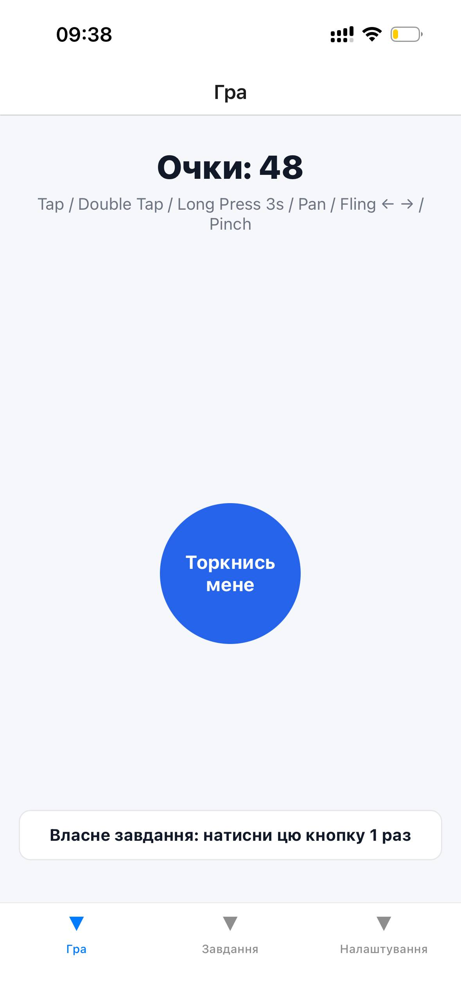
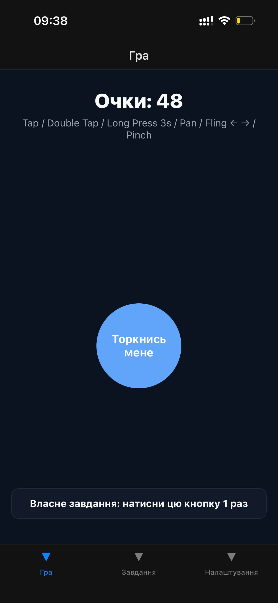
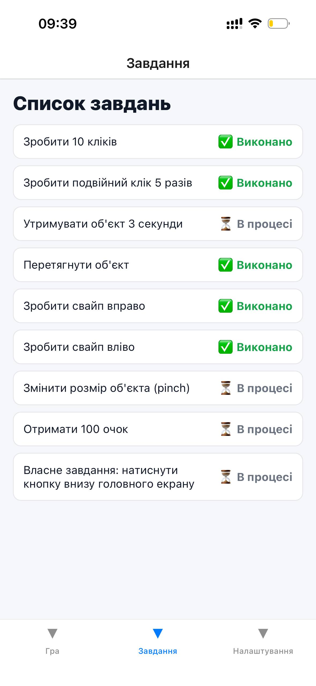
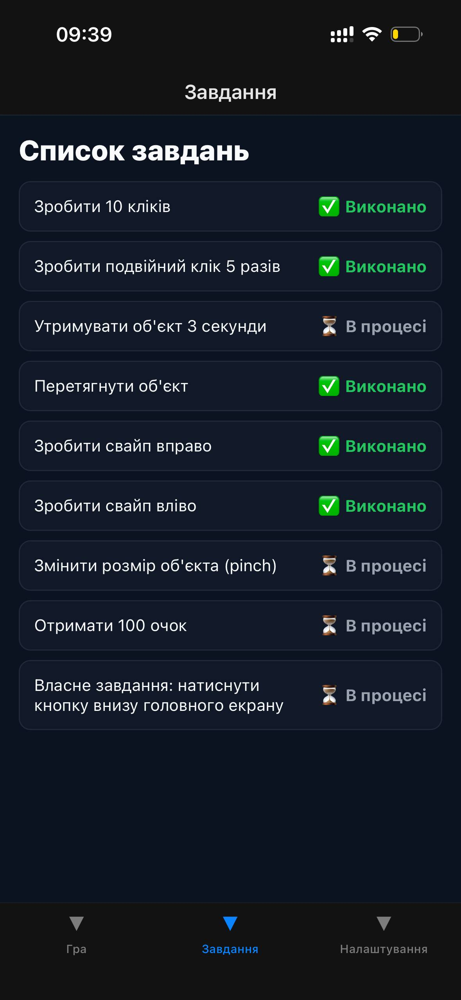
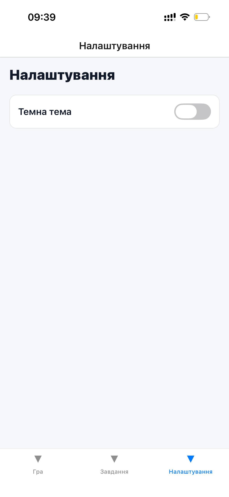

# Lab 03

Короткий опис: мобільний застосунок на React Native, виконаний у межах лабораторної роботи №3.

## Інструкція запуску

### Вимоги
- Node.js (LTS)
- npm або yarn
- React Native CLI / Expo CLI (залежно від конфігурації проєкту)
- Android Studio (для Android) та/або Xcode (для iOS, macOS)

### Кроки запуску
1. Перейти до директорії лабораторної:
   ```bash
   cd lab03
   ```

2. Встановити залежності:
   ```bash
   npm install
   ```
   або
   ```bash
   yarn install
   ```

3. Запустити застосунок:

   Якщо використовується Expo:
   ```bash
   npm run start
   ```
   або
   ```bash
   yarn start
   ```

   Якщо використовується React Native CLI:
   ```bash
   npx react-native run-android
   ```
   або
   ```bash
   npx react-native run-ios
   ```

## Опис реалізованого функціоналу

У цій лабораторній роботі реалізовано базову структуру мобільного застосунку, що включає:
- відображення основного інтерфейсу;
- взаємодію користувача з елементами UI;
- обробку стану компонентів;
- навігацію між екранами (за наявності в поточній реалізації);
- стилізацію відповідно до вимог лабораторної роботи.

> Примітка: за потреби цей розділ можна деталізувати під фактично реалізовані екрани та сценарії.

## Скріншоти роботи застосунку
|  |  |
|--|--|
|  |  |
|  |  |
|  |  |

## Висновки

Навчився працювати з жестами користувача у мобільному
застосунку, реалізувати взаємодію через різні типи жестів та застосувати
сучасні підходи стилізації у React Native.