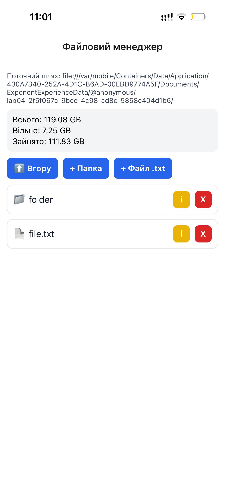
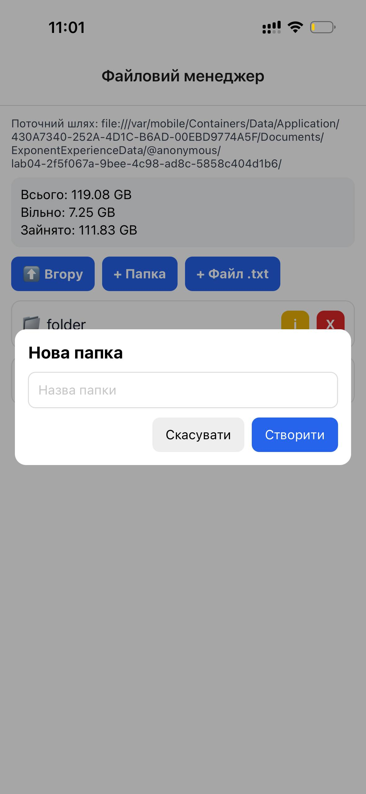
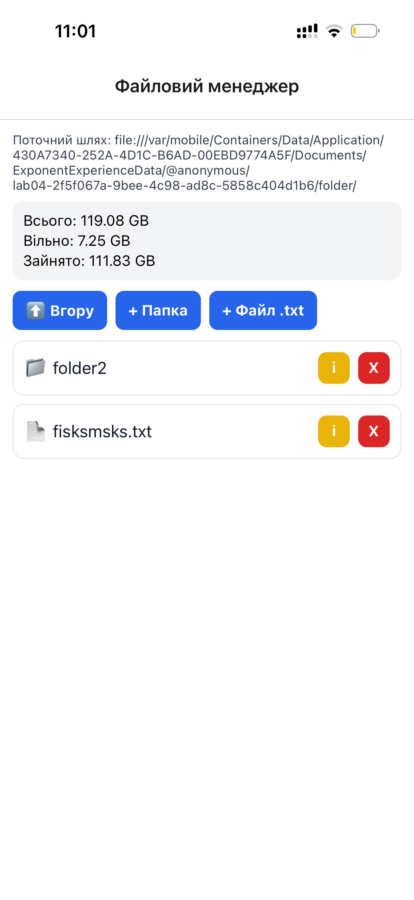
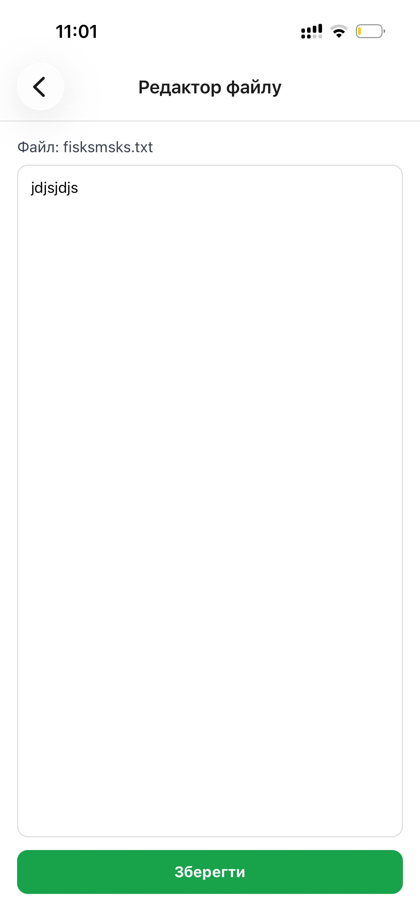
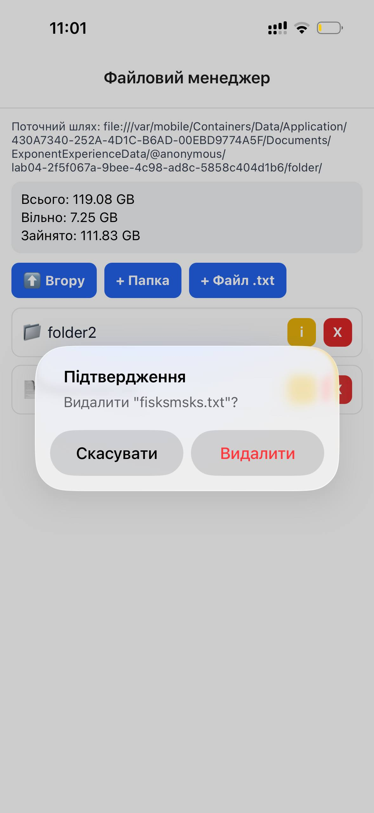
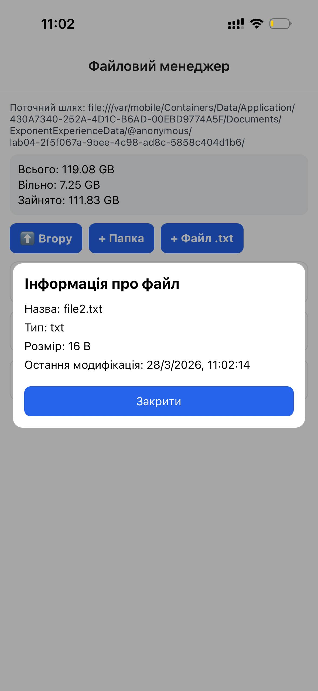

# Lab 04

Короткий опис: мобільний застосунок на React Native (Expo) з базовим файловим менеджером для роботи з локальними `.txt` файлами.

## Інструкція запуску

### Вимоги
- Node.js (LTS)
- npm
- Expo CLI / Expo Go (або Android/iOS емулятор)

### Кроки запуску
1. Перейти до директорії лабораторної:
   ```bash
   cd lab04
   ```

2. Встановити залежності:
   ```bash
   npm install
   ```

3. Запустити проєкт:
   ```bash
   npm run start
   ```

4. Відкрити застосунок:
- `a` — запуск на Android
- `i` — запуск на iOS (тільки macOS)
- `w` — запуск у браузері
- або сканувати QR-код через Expo Go

## Опис реалізованого функціоналу

У застосунку реалізовано:

- перегляд вмісту поточної директорії у внутрішньому сховищі застосунку;
- навігацію по файловій структурі (вхід у папку, перехід на рівень вище);
- створення нової папки;
- створення нового `.txt` файлу з початковим вмістом;
- відкриття та редагування `.txt` файлів;
- збереження змін у файлі;
- видалення файлів і папок з підтвердженням;
- перегляд інформації про об’єкт (назва, тип, розмір, дата модифікації);
- відображення статистики пам’яті пристрою (всього, вільно, зайнято).

## Скріншоти роботи застосунку
|  |                         |
|--|-------------------------|
|  |  |
|  |  |
|  |  |

## Висновки

Опанував механізми роботи з локальною файловою системою
мобільного пристрою, використовуючи можливості бібліотеки expofile-system. Закріпив навички реалізації базових операцій над
файлами й папками, організації файлової навігації та аналізу стану
файлової системи.