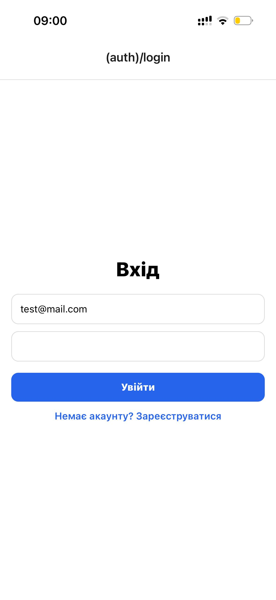
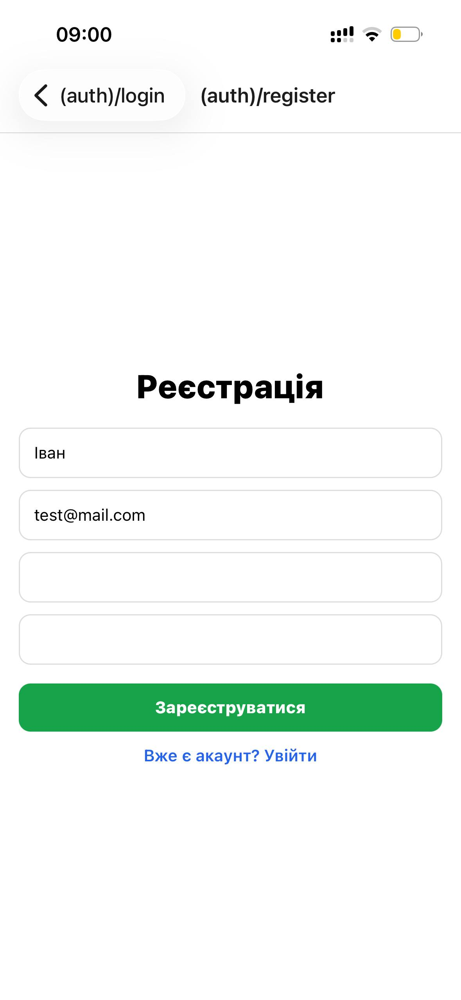
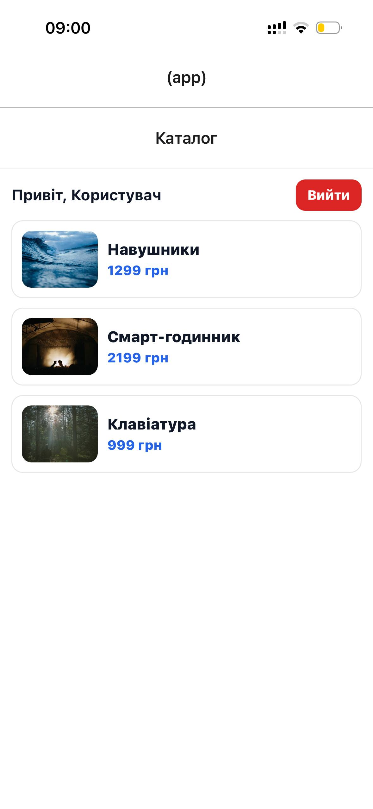
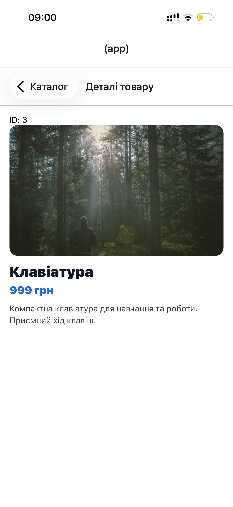

# Lab 05

Короткий опис: мобільний застосунок на React Native (Expo) з використанням `expo-router`, що реалізує просту авторизацію (mock) та каталог товарів з екраном деталей.

## Інструкція запуску

### Вимоги
- Node.js (LTS)
- npm
- Expo Go (або Android/iOS емулятор)

### Кроки запуску
1. Перейти до директорії лабораторної:
   ```bash
   cd lab05
   ```

2. Встановити залежності:
   ```bash
   npm install
   ```

3. Запустити проєкт:
   ```bash
   npm run start
   ```

4. Відкрити застосунок:
- `a` — запуск на Android
- `i` — запуск на iOS (тільки macOS)
- `w` — запуск у браузері
- або сканувати QR-код через Expo Go

## Опис реалізованого функціоналу

У застосунку реалізовано:
- маршрутизацію через `expo-router` з групами маршрутів:
    - `(auth)` — екрани входу та реєстрації;
    - `(app)` — основна частина застосунку (каталог і деталі);
- просту авторизацію (імітація) через React Context:
    - вхід за наявності введених значень email і паролю;
    - реєстрація з перевіркою підтвердження паролю;
    - збереження імені користувача в контексті;
    - вихід з акаунту;
- захист маршрутів: якщо користувач не авторизований — редірект на `/login`;
- екран каталогу товарів зі списком і переходом на деталі;
- екран деталей товару з відображенням параметра маршруту `id`;
- екран `+not-found` для неіснуючих маршрутів.

## Скріншоти роботи застосунку
|  |                         |
|--|-------------------------|
|  |  |
|  |  |

## Висновки

1. **Яким чином за допомогою Expo Router реалізується перенаправлення неавторизованого користувача?**  
   Перенаправлення реалізується на рівні layout-компонента (наприклад, `app/(app)/_layout.tsx`): перевіряється стан авторизації (наприклад, `isAuthenticated` з контексту) і, якщо користувач неавторизований, повертається компонент редіректу на маршрут входу, наприклад `<Redirect href="/login" />`. Таким чином захист застосовується одразу до всієї групи маршрутів.

2. **У чому полягає різниця між використанням компонента `<Link>` та метода `router.push()`?**  
   `<Link>` - декларативний спосіб навігації: описує перехід як частину UI (натискання на елемент веде на вказаний маршрут).  
   `router.push()` - імперативний спосіб: викликається в коді (наприклад, після успішного логіну/реєстрації або після виконання певної перевірки) і програмно виконує перехід.  
   Тобто `<Link>` зручний для “кнопок/карток переходу”, а `router.push()`/`router.replace()` - для навігації як результату логіки.

3. **Як працюють динамічні маршрути в Expo Router і як отримати передані параметри?**  
   Динамічний маршрут задається через файл/папку з назвою у квадратних дужках, наприклад `details/[id].tsx`.  
   Значення параметра (`id`) передається в URL/шлях (наприклад, перехід на `/details/2`) і зчитується на екрані через `useLocalSearchParams()`, наприклад:  
   `const { id } = useLocalSearchParams<{ id: string }>();`

4. **Чому стан авторизації доцільно зберігати у глобальному контексті (React Context), а не в локальному стані компонента?**  
   Стан авторизації потрібен багатьом екранам/лейаутам одночасно (перевірка доступу, відображення імені користувача, кнопка “Вийти”, редіректи).  
   Якщо тримати його в локальному state окремого компонента, інші частини застосунку не матимуть до нього прямого доступу або доведеться передавати його через props (prop drilling).  
   React Context дає єдине джерело правди для всієї ієрархії компонентів і спрощує контроль доступу до маршрутів.

5. **Для чого використовуються групи маршрутів (folderName) і як вони впливають на URL-адресу?**  
   Групи маршрутів у `expo-router` використовуються для логічного структурування (наприклад, розділення авторизаційних екранів і основної частини застосунку) та для застосування спільних layout/налаштувань до цілої групи.  
   Якщо папка названа в дужках, наприклад `(auth)` або `(app)`, то це “route group”, і вона **не додається** до URL/шляху. Тобто група впливає на організацію та layout, але не змінює кінцеву адресу маршруту.