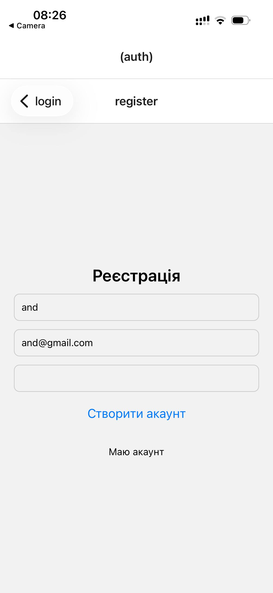
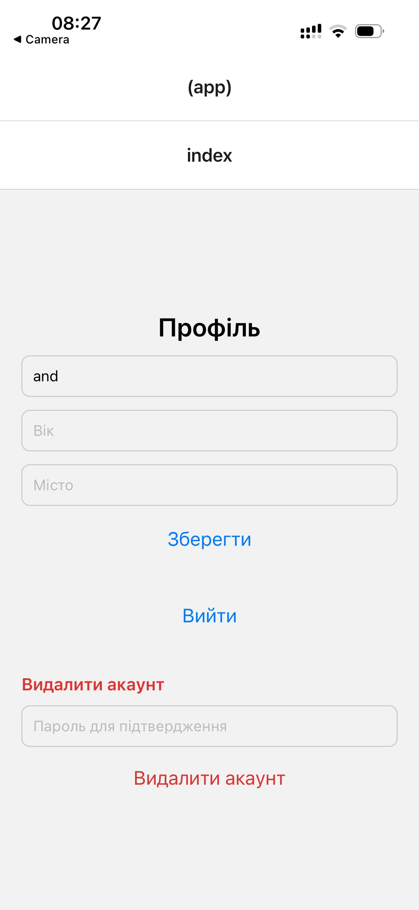
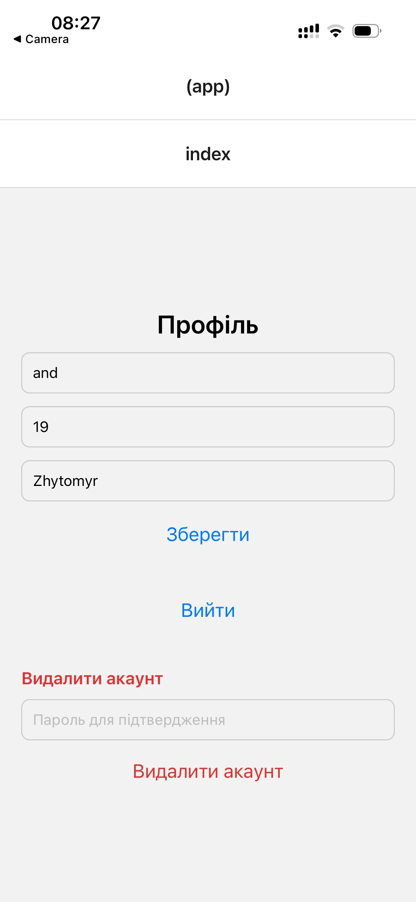
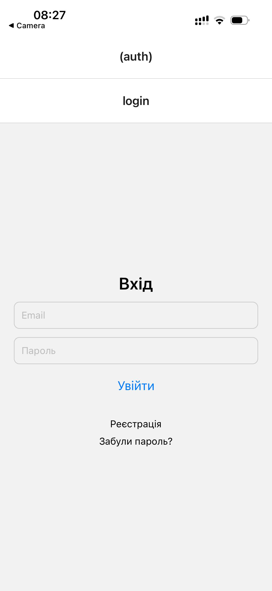
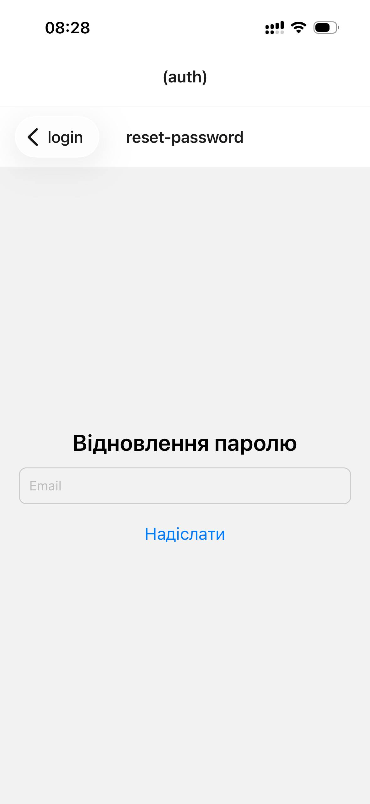

# Лабораторна робота №6
**Тема:** Побудова авторизації та збереження персональних даних у React Native з використанням Firebase Authentication та Firestore

## Інструкція запуску

### Вимоги
- Node.js (LTS)
- npm
- Expo Go (або Android/iOS емулятор)

### Кроки запуску
1. Перейдіть у папку лабораторної роботи:
   ```bash
   cd lab06
   ```

2. Встановіть залежності:
   ```bash
   npm install
   ```

3. Створіть файл `.env` на основі `.env.example` та заповніть ключі Firebase.

4. Запустіть проєкт:
   ```bash
   npm run start
   ```

5. Відкрити застосунок:
- `a` — запуск на Android
- `i` — запуск на iOS (тільки macOS)
- `w` — запуск у браузері
- або сканувати QR-код через Expo Go

## Опис реалізованого функціоналу
- **Авторизація користувача**
    - Реєстрація за email та паролем.
    - Вхід існуючого користувача.
    - Вихід із системи.
- **Збереження персональних даних**
    - Після входу користувач заповнює/оновлює профіль (ім’я, вік, місто).
    - Дані зберігаються у Firestore в колекції `users` з документом `uid`.
- **Захист доступу**
    - Усі запити до Firestore виконуються лише для власного `uid`.
    - Додані правила безпеки Firestore.
- **Редагування та видалення акаунту**
    - Оновлення профілю через форму.
    - Видалення акаунту з підтвердженням.
    - Повторна автентифікація перед видаленням.
- **Відновлення паролю**
    - Надсилання email для скидання паролю через Firebase API.
- **Expo Router**
    - Розділення маршрутів на `(auth)` та `(app)`.
    - Захищена навігація через Redirect у `_layout.tsx`.
- **AuthContext**
    - Централізоване керування станом авторизації.

## Скріншоти роботи застосунку
|                         |                        |
|-------------------------|------------------------|
|  |  |
|  |  |
|  ||


## Висновки
У ході виконання лабораторної роботи реалізовано повний цикл авторизації користувача в мобільному застосунку на React Native з використанням Firebase Authentication та Firestore. Набуто практичних навичок роботи з профілем користувача, захистом доступу до даних, скиданням паролю та видаленням акаунту.