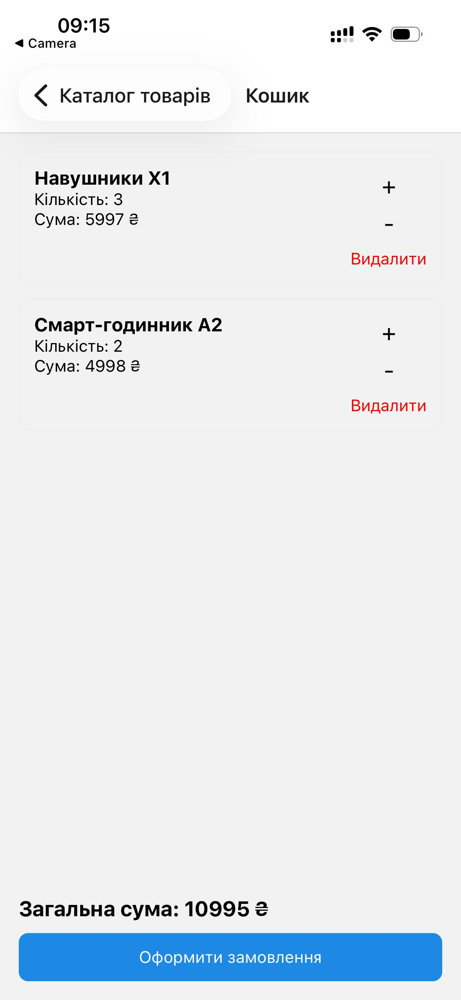
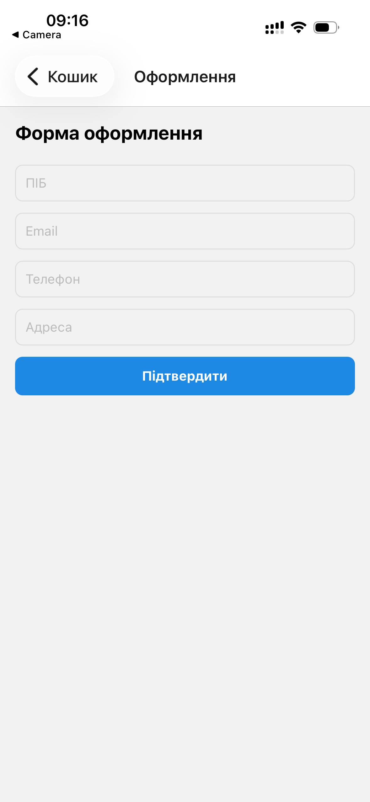
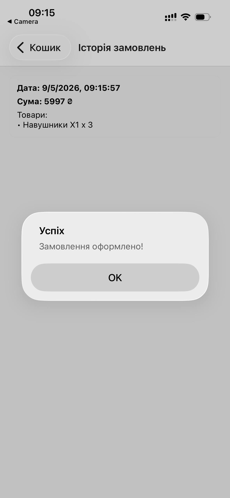

# Лабораторна робота №7
**Тема:** Використання Redux Toolkit для управління станом при розробці мобільних застосунків

## Інструкція запуску

### Вимоги
- Node.js (LTS)
- npm
- Expo Go (або Android/iOS емулятор)

### Кроки запуску
1. Перейти до директорії лабораторної:
   ```bash
   cd lab07
   ```

2. Встановити залежності:
   ```bash
   npm install
   ```

3. Запустити проєкт:
   ```bash
   npm run start
   ```

4. Відкрити застосунок:
- `a` — запуск на Android
- `i` — запуск на iOS (тільки macOS)
- `w` — запуск у браузері
- або сканувати QR-код через Expo Go

## Опис реалізованого функціоналу
- **Каталог товарів**
  - Відображення списку товарів із зображенням, назвою, описом та ціною.
  - Перехід у деталі товару.
  - Додавання товару в кошик.
  - Дані зберігаються у `productsSlice`.

- **Кошик**
  - Перегляд усіх доданих товарів.
  - Зміна кількості або видалення товарів.
  - Автоматичний підрахунок загальної суми.
  - Кнопка “Оформити замовлення”.
  - Дані зберігаються у `cartSlice` та зберігаються через `redux-persist`.

- **Оформлення замовлення**
  - Форма з полями ПІБ, email, телефон, адреса.
  - Базова валідація перед підтвердженням.
  - Очищення кошика після успішного оформлення.
  - Збереження замовлення в історію.
  - Дані зберігаються у `usersSlice`.

- **Історія замовлень**
  - Окремий екран зі списком замовлень.
  - Для кожного запису: дата, список товарів, загальна сума.
  - Дані зберігаються у `ordersSlice` та не стираються після перезапуску (redux-persist).

## Скріншоти роботи застосунку
|                         |                        |
|-------------------------|------------------------|
|  |  |
|  |  |
|  ||

## Висновки (контрольні запитання)

1. **Що таке глобальний стан у React Native?**  
   Це спільне сховище даних, яке доступне з будь-якого компонента застосунку.

2. **Для чого використовується Redux Toolkit?**  
   Для простішого та швидшого налаштування Redux, з меншою кількістю коду.

3. **Яке призначення createSlice?**  
   Це зручний спосіб створити reducer та actions для певної частини стану.

4. **Для чого використовується configureStore?**  
   Для створення Redux Store з потрібними reducer’ами та middleware.

5. **Для чого використовується redux-persist?**  
   Для збереження стану між перезапусками застосунку (наприклад, кошика чи історії).